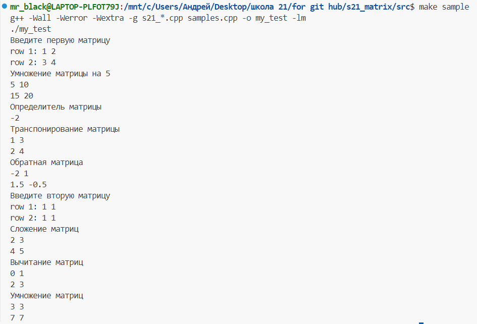

# s21_matrix

Реализация библиотеки s21_matrix_oop.h


## Contents

1. [Introduction](#introduction)
2. [Information](#information)
3. [Project description](#project-description)
4. [Sample](#sample)


## Introduction

В данном проекте реализована библиотека **s21_matrix** для работы с матрицами, используя **объектно-ориентированный подход**. ООП позволяет реализовать библиотеку для работы с матрицами в виде отдельного класса, над объектами которого определены операции, представленные как методами, так и стандартными операторами +, -, * и т.д.


## Information

### C++ и C

C++ - язык программирования, разработанный на базе языка C для реализации программ с применением объектно-ориентированного подхода. Это означает, что общие правила синтаксиса языка C++ напрямую унаследованы из C, и, следовательно, большая часть кода, написанного на языке C, может быть скопирована в текст программы на C++ и успешно скомпилирована. По большей части, C++ лишь добавляет новые возможности для программиста или несколько изменяет их, нежели что-то отнимает, поэтому, говоря о C++, легче говорить о различиях (см. материалы), чем о сходствах. 

### Пример класса матрицы на C++

```cpp
class S21Matrix {
    private:
        // Attributes
        int rows_, cols_;         // Rows and columns
        double **matrix_;         // Pointer to the memory where the matrix is allocated

    public:
        S21Matrix();              // Default constructor
        ~S21Matrix();             // Destructor

        void SumMatrix(const S21Matrix& other); 
        // Other methods..
}
```

### Основных положения о матрице

Матрица - прямоугольная таблица чисел, расположенных в m строках и n столбцах:

```
    1 2 3
A = 4 5 6
    7 8 9
```

```
     1  2  3  4
В =  5  6  7  8
     9 10 11 12
```

Получить нужный элемент можно при помощи индексов, так
A[1,1] = 1, где первый индекс - номер строки, второй - номер столбца.

Порядок матрицы — это число ее строк или столбцов. \
Главная диагональ квадратной матрицы — это диагональ, идущая из левого верхнего в правый нижний угол. \
Прямоугольная матрица (В) — это матрица, у которой число строк не равно числу столбцов. \
Квадратная матрица (А) — это матрица у которой число строк равно числу столбцов.

### Операции над матрицами

Ниже представлено краткое описание операций над матрицами, реализованные в разработанной библиотеке. 

| Операция    | Описание   | Исключительные ситуации |
| ----------- | ----------- | ----------- |
| `bool EqMatrix(const S21Matrix& other)` | Проверяет матрицы на равенство между собой. |  |
| `void SumMatrix(const S21Matrix& other)` | Прибавляет вторую матрицы к текущей | различная размерность матриц. |
| `void SubMatrix(const S21Matrix& other)` | Вычитает из текущей матрицы другую | различная размерность матриц. |
| `void MulNumber(const double num)` | Умножает текущую матрицу на число. |  |
| `void MulMatrix(const S21Matrix& other)` | Умножает текущую матрицу на вторую. | число столбцов первой матрицы не равно числу строк второй матрицы. |
| `S21Matrix Transpose()` | Создает новую транспонированную матрицу из текущей и возвращает ее. |  |
| `S21Matrix CalcComplements()` | Вычисляет матрицу алгебраических дополнений текущей матрицы и возвращает ее. | Матрица не является квадратной. |
| `double Determinant()` | Вычисляет и возвращает определитель текущей матрицы. | Матрица не является квадратной. |
| `S21Matrix InverseMatrix()` | Вычисляет и возвращает обратную матрицу. | Определитель матрицы равен 0. |

Помимо реализации данных операций, необходимо также реализовать конструкторы и деструкторы:

| Метод    | Описание   |
| ----------- | ----------- |
| `S21Matrix()` | Базовый конструктор, инициализирующий матрицу некоторой заранее заданной размерностью. |  
| `S21Matrix(int rows, int cols)` | Параметризированный конструктор с количеством строк и столбцов. | 
| `S21Matrix(const S21Matrix& other)` | Конструктор копирования. |
| `S21Matrix(S21Matrix&& other)` | Конструктор переноса. |
| `~S21Matrix()` | Деструктор. |

А также нужно перегрузить следующие операторы, частично соответствующие операциям выше:

| Оператор    | Описание   | Исключительные ситуации |
| ----------- | ----------- | ----------- |
| `+`      | Сложение двух матриц.  | Различная размерность матриц. |
| `-`   | Вычитание одной матрицы из другой. | Различная размерность матриц. |
| `*`  | Умножение матриц и умножение матрицы на число. | Число столбцов первой матрицы не равно числу строк второй матрицы. |
| `==`  | Проверка на равенство матриц (`EqMatrix`). | |
| `=`  | Присвоение матрице значений другой матрицы. | |
| `+=`  | Присвоение сложения (`SumMatrix`).   | Различная размерность матриц. |
| `-=`  | Присвоение разности (`SubMatrix`). | Различная размерность матриц. |
| `*=`  | Присвоение умножения (`MulMatrix`/`MulNumber`). | Число столбцов первой матрицы не равно числу строк второй матрицы. |
| `(int i, int j)`  | Индексация по элементам матрицы (строка, колонка). | Индекс за пределами матрицы. |


## Project description

- Программа разработана на языке C++ стандарта C++17 с использованием компилятора gcc;
- Матрица реализована в виде класса `S21Matrix`;
- В приватных полях хранится только `matrix_`, `rows_` и `cols_`;
- Доступ к приватным полям `rows_` и `cols_` осуществляется через accessor и mutator. При увеличении размера матрица дополняется нулевыми элементами, при уменьшении - лишнее просто отбрасывается;
- Реализованы операции, описанные [выше](#операции-над-матрицами)
- Перегружены операторы в соответствии с таблицой в разделе [выше](#операции-над-матрицами).
- Подготовлено полное покрытие unit-тестами функций библиотеки c помощью библиотеки GTest;
- Предусмотрен Makefile для сборки библиотеки и тестов (с целями all, clean, test, s21_matrix_oop.a).
- Цель gcov_report готовит отчет покрытия тестами


## Sample

- Пример использования библиотеки
- В папке src запускаем цель ``` make sample``` и вводим две матрицы


